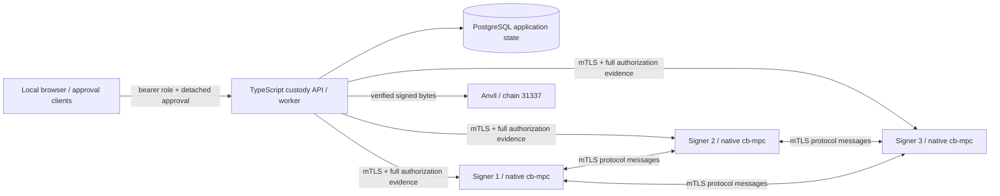
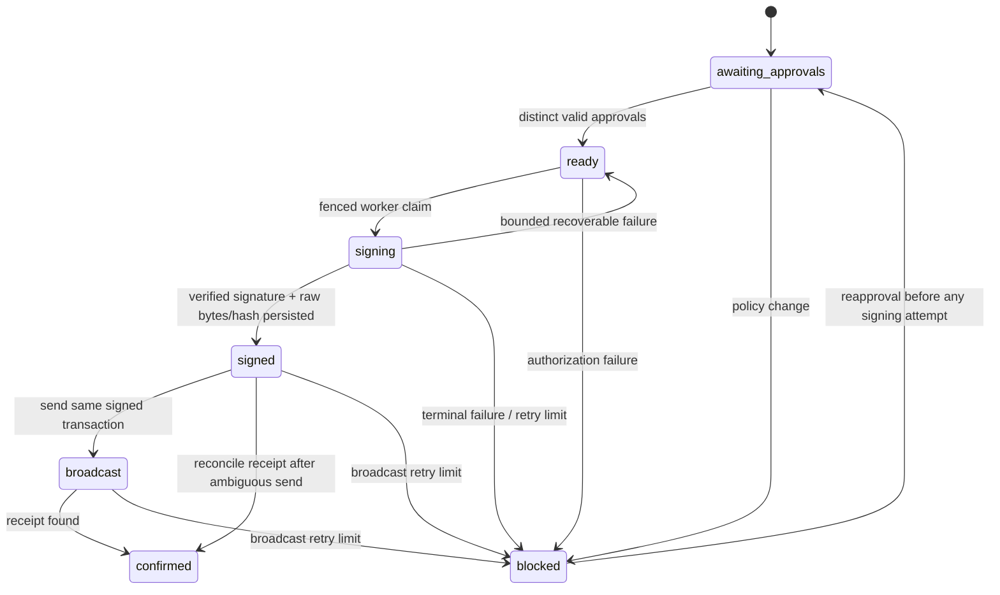
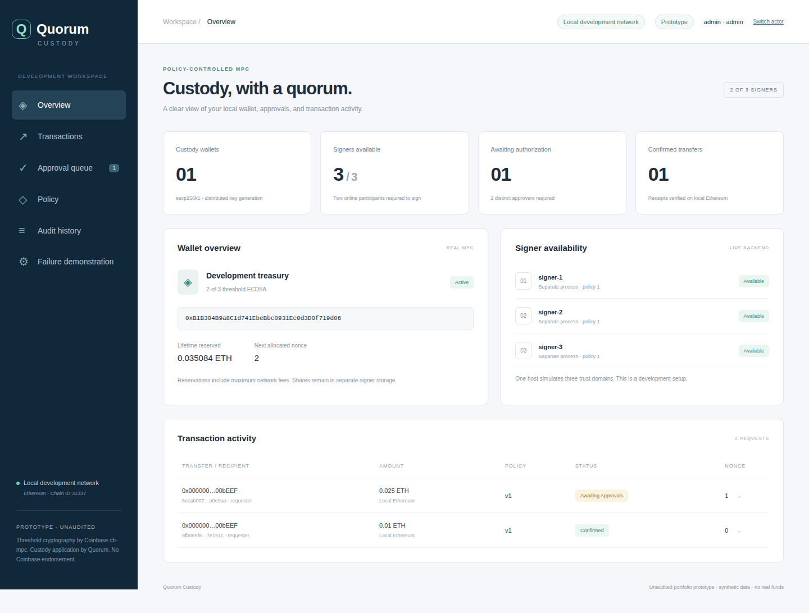
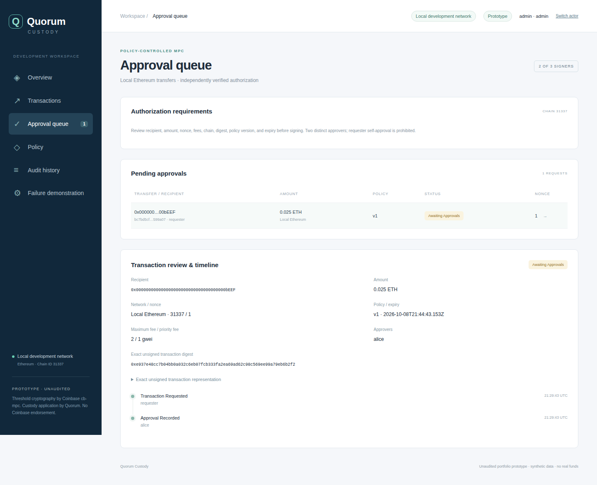
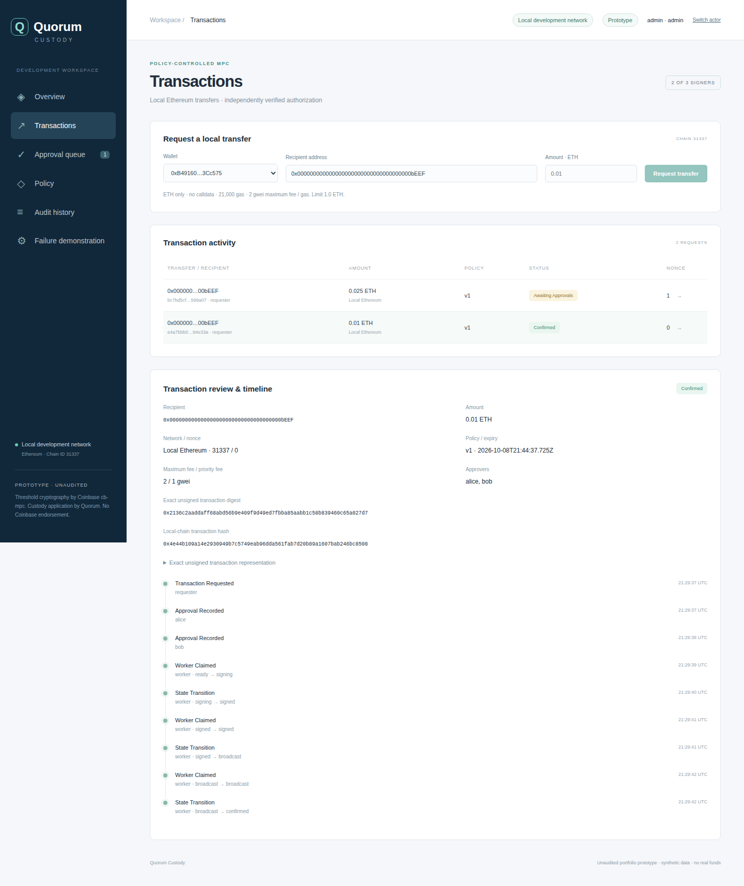
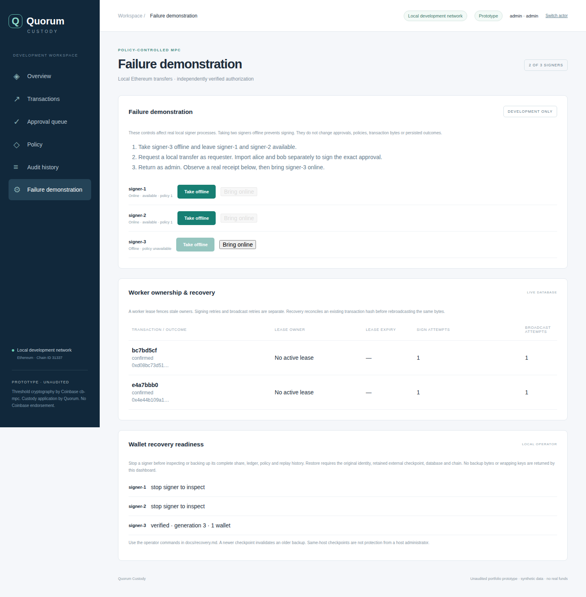

# Quorum Custody

A policy-controlled MPC custody for local Ethereum ETH transfers.
Three separate signer processes create a real 2-of-3 secp256k1 wallet with Coinbase
[cb-mpc](https://github.com/coinbase/cb-mpc). Two distinct people approve the exact
unsigned transaction; two available signers independently verify that evidence,
produce a threshold ECDSA signature, and the custody worker verifies and broadcasts
it to Anvil. A third signer can be offline during signing.


## What is implemented

- Real distributed key generation and signing via the public C++ API. Each share
  remains in a distinct signer directory, AES-256-GCM encrypted with a local
  wrapping key. There is no reconstruction/export endpoint.
- Typed ETH-only request validation; recipient allowlists; per-transfer and lifetime
  aggregate limits including maximum fees; independently signed policy and approvals.
- Actor-scoped idempotency, row-locked spending reservations and nonce allocation,
  distinct approvers, requester separation, approval expiry, and reapproval after edits.
- Pinned peer certificates and TLS 1.3 mutual authentication. Protocol names derive
  from certificate fingerprints; messages bind session, participants, evidence,
  sender and sequence. Bounded sessions, timeouts, queues and retries.
- A persisted state machine with worker leases and fencing. Signature verification,
  signed-byte/hash persistence before RPC, and reconciliation after ambiguous broadcast.
- A real React dashboard with wallet status, requests, approvals, signed policy,
  transaction details/timeline and application audit history.

Coinbase provides the cryptographic protocols, proofs, public API and keyshare
serialization. This project contributes authorization, transport, separate signer
storage, persistence, orchestration, lifecycle recovery and UI. It does not implement
new cryptography. Attribution and upstream license are in
[docs/COINBASE-LICENSE.md](docs/COINBASE-LICENSE.md).

## Quick start

Prerequisites: Node **22.20.0**, npm 10+, Docker with Compose, Git, CMake, a supported
C++ compiler (upstream recommends Clang 20+; tested here with AppleClang 21),
OpenSSL CLI, and Anvil on PATH. Verified host: macOS ARM64. See
[verification](docs/verification.md) for exact tested tool versions and limitations.

```sh
make demo
```

This installs the lockfile, fetches cb-mpc at
`0b716706f998633912ee2be9b9bf8909aed66088`, builds its required patched OpenSSL
3.6.4 after checking upstream's SHA-256, builds the native adapter, builds the UI,
generates local TLS certificates/actor credentials, starts PostgreSQL with Compose,
runs three signer processes and Anvil, and executes the interview demo.
The first build takes several minutes and downloads upstream dependencies.
Docker is used for PostgreSQL; signer/API/Anvil processes run natively in the
verified development path. This is deliberately a small hybrid setup, not a claim
that a complete container trust-domain deployment has been verified.

Open [the dashboard](http://127.0.0.1:4300). Import `.dev/actors/admin.json` to
inspect wallets/policy, `requester.json` to create transfers, and `alice.json` /
`bob.json` to approve. Import is local file reading: private signing keys remain
in browser memory, and the API receives only detached signatures. Reloading clears
the imported identity. Actor files, wrapping keys, CA keys and bearer tokens are
**development secrets**; `.dev*/` is ignored and excluded from the release archive.

The demo creates a fresh wallet, grants a synthetic Anvil balance, sends 0.01 ETH,
checks rejection of missing approvals, stops signer-3, gets two approvals, signs
with the remaining two parties, broadcasts and verifies the receipt, rejects an
alteration and insufficient quorum, restores signer-3, and leaves a real partial
approval in the queue. It prints only public identifiers and result labels.

```sh
make check        # typecheck, lint, formatting, UI/API build, unit/property tests
make integration  # real MPC + PostgreSQL + Anvil; requires a running local demo
make screenshots  # real Playwright capture; native browser launch may be sandbox-blocked
make stop         # stops only this project's recorded processes and Compose services
```

Integration tests create additional synthetic wallets/requests, change the policy
version, stop/restart the test API and signers, and exercise failure cases. Prefer
an isolated profile described in [CONTRIBUTING](CONTRIBUTING.md). Never run them
against valuable application state. No global Docker prune or volume removal is
used. `make stop` retains the database. Anvil's default state is ephemeral, so
restarting the chain invalidates previous receipts/balances: use a **new isolated
profile** for a clean demo rather than treating previous chain state as durable.

## Architecture and authorization



Approvals cover the transaction digest, wallet, request ID, requester, signed
policy version and expiry under an explicit application domain. Each signer
re-parses the exact EIP-1559 unsigned bytes, checks chain/type/recipient/value/gas/
fees/calldata, recomputes the Keccak digest, verifies distinct Ed25519 approval
signatures and the admin policy signature, and checks its locally stored wallet
public key, nonce and reservation ledger. It never accepts a coordinator's boolean
approval flag. ethers handles transaction encoding, public-key address derivation,
low-S signature assembly and recovery; noble independently verifies the MPC ECDSA.



No database transaction is held during MPC or chain RPC. Work for each wallet
advances in nonce order; unresolved lower nonces block later requests. A signed
transaction is persisted before any external delivery and is retried using the
same deterministic hash. This provides retry/reconciliation behavior, **not
exactly-once external delivery**. See [architecture](docs/architecture.md).

## Real dashboard screenshots

Captured from the running backend through browser automation, using synthetic
actors and transactions. There are no UI fixtures or generated screenshots.







## Verification and limits

The real integration suite has passed 17 boundary groups, and 20 unit/property
checks passed. Six real resilience groups exercise fault controls and complete-state
recovery. A fresh source-copy `make demo` is separately verified; exact results
and any skipped paths are recorded in [verification](docs/verification.md).

This is a demonstration of boundaries, not an audited security product. All signer
processes and credentials currently share a host/OS account. An administrator of
that host can read enough local material to compromise custody. Wrapping keys are
next to encrypted shares. Offline encrypted backup/restore is available with retained
checkpoints and identities; there is no KMS/HSM, production recovery ceremony, identity
rotation, share refresh, hardware isolation or production incident workflow. Development
certificates expire after seven days.

Aggregate reservations are authoritative in PostgreSQL for honest application
operation; signer ledgers add conservative local checks but **do not implement a
Byzantine global spending ledger across rotating quorums**. A compromised
coordinator/database can undermine the global budget, deny service, or reorder
requests even though it cannot invent two valid approvals for new transaction
bytes. Policy revocation is not instantaneous at offline signers. Audit rows are
protected from modification by the app role, not immutable against a database
administrator. Read the [threat model](docs/threat-model.md) before discussing any
security guarantees.

## Review map

```text
native/              public cb-mpc process adapter; encrypted share storage
src/domain.ts        policy, validation, authorization and state contracts
src/encoding.ts      canonical evidence shared by browser and backend
src/signer.ts        authenticated peer transport and signer authorization
src/native.ts        bounded process/pipe transport
src/mpc.ts           quorum orchestration and independent signature verification
src/custody.ts       requests, approvals, edits and signed policy updates
src/db.ts            short transaction helpers and evidence assembly
src/schema.sql       durable constraints and application/audit state
src/worker.ts        claims, leases, fencing and chain reconciliation
src/api.ts           authenticated HTTP boundary and static dashboard
ui/                  TypeScript React dashboard
scripts/             provisioning, build, demo, process control and screenshots
tests/               unit/property and real integration boundaries
docs/                architecture, threat model, ADRs, verification and images
.github/workflows/   CI with the real native/DB/chain path
```

Start a review with [the walkthrough](docs/walkthrough.md), then the
[decision records](docs/decisions). Prioritized unresolved work is in the threat
model. The MIT license applies to our application code; upstream licenses remain
with their respective components. No endorsement is implied.

## Failure demonstration and wallet recovery

From a fresh clone, use `QUORUM_DEMO_CONTROLS=1 make demo`. If an existing profile
is present, create an isolated opt-in profile instead:

```sh
export QUORUM_DEV=.dev-resilience QUORUM_PORT_OFFSET=4000
export QUORUM_COMPOSE_PROJECT=quorum-custody-resilience QUORUM_DEMO_CONTROLS=1
make demo
npm run resilience
```

The isolated dashboard is at `http://127.0.0.1:8300`; actor files are under
`.dev-resilience/actors/`. Keep these environment variables for `make stop`.
Import admin.json and open **Failure demonstration** to stop/restart real managed
signers, inspect worker leases and separate retry counts, and observe local receipts.
Controls require admin authentication, a loopback bind and explicit profile opt-in;
they never bypass approvals. Existing profiles keep controls disabled.

[Wallet recovery](docs/recovery.md) provides offline, password-encrypted per-signer
backups, complete state restoration, stale-checkpoint rejection and public orphan
inventory. Run `npm run resilience` for the real failure/restore exercise. It does
not reconstruct a private key or restore missing database/chain/TLS identities.

CI separates real native/demo, checks, browser approval, integration, resilience and
project-only teardown. Test reports and real browser screenshots are uploaded as
verification evidence; credentials, backups and browser traces are excluded.



## Institutional roadmap: first local slice

The new roadmap audit and first authorization/evidence slice are documented in
[Gap analysis](docs/engineering/GAP_ANALYSIS.md),
[Implementation plan](docs/engineering/IMPLEMENTATION_PLAN.md), and
[Broadcast authorization boundary](docs/engineering/AUTHORIZATION_BOUNDARY.md).
The worker revalidates authorization before each new external broadcast decision;
signed policy supports optional freeze and recipient denylist controls.
The admin **Custody evidence** screen shows sourced MiCA requirements, actual
implementation/test references, gaps and a downloadable source-hash inventory.
It makes no compliance certification claims. Tenant/client ownership, position
registers, statements, HSM/KMS, refresh ceremonies and the remaining institutional
roadmap are not implemented. See [slice verification](docs/engineering/VERIFICATION.md)
for executed versus pending checks; historical CI does not verify local edits.
